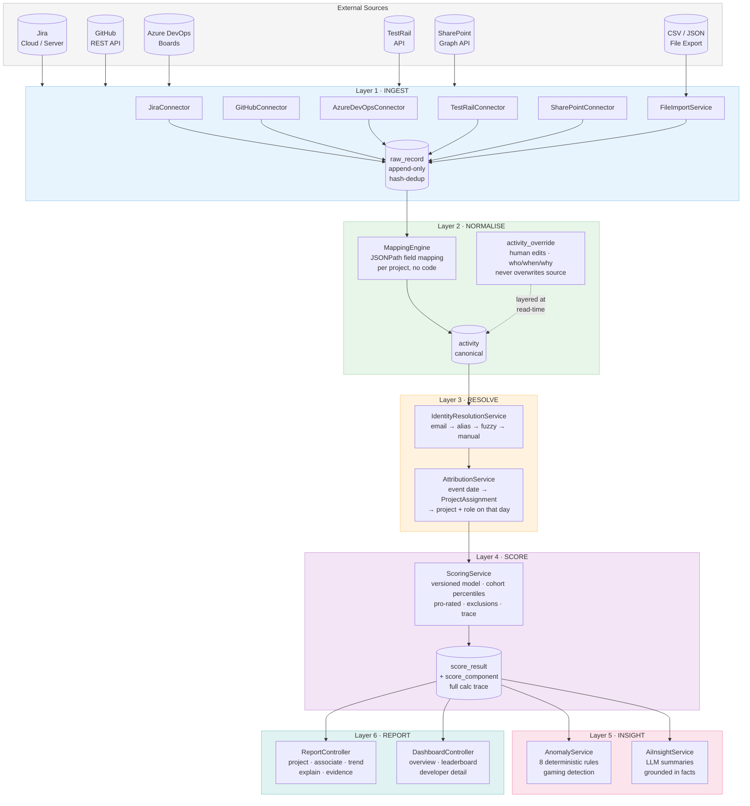
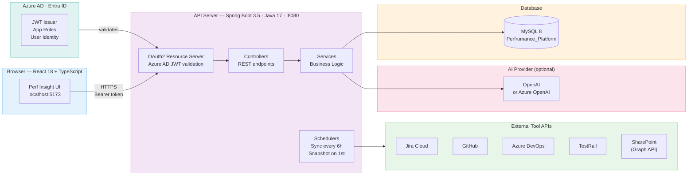
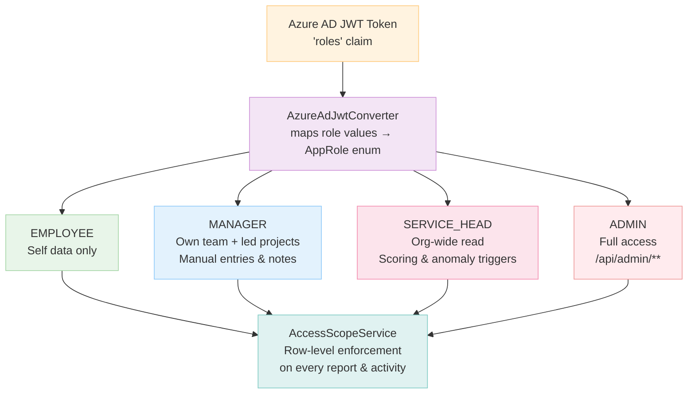
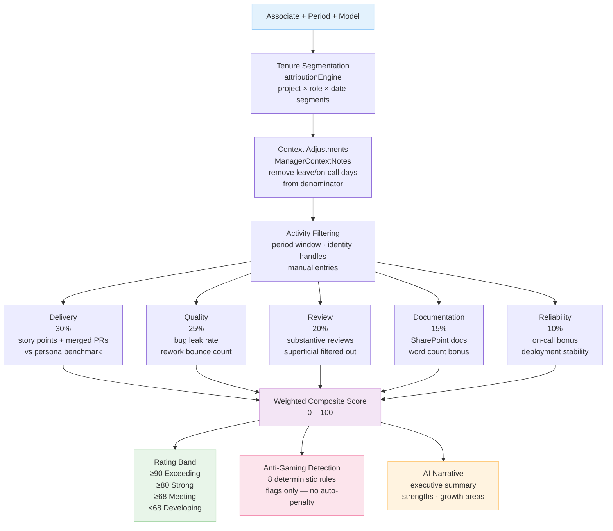

# System Architecture — Perf Insight

## Overview

Perf Insight is a **6-layer engineering performance intelligence platform** built for Psiog. It ingests raw activity data from developer toolchains (JIRA, GitHub, Azure DevOps, TestRail, SharePoint), normalises and attributes it, scores each engineer across five weighted dimensions, detects anti-gaming patterns, and generates AI-grounded narrative insights — all with a full audit trail and role-based access via Azure AD.

---

## 6-Layer Pipeline

---

## Deployment Architecture

---

## Security & Access Control

---

## Scoring Algorithm Flow

---

## Package Map

| Package | Responsibility |
|---------|---------------|
| `security` | Azure AD JWT validation → internal roles, dev-mode header auth, `AccessScope` (Employee = self, Manager = team, ServiceHead/Admin = all) |
| `org` | Offerings, teams, associates, projects, effective-dated assignments |
| `ingest` | Tool configs, connector SPI (LIVE/MOCK/FILE), mapping engine, incremental sync, scheduler, file import |
| `identity` | Cross-tool identity resolution, manual link/unlink, unmatched activity report |
| `activity` | Canonical activities, manual entries, overrides, attribution, drill-down queries |
| `notes` | Manager context notes (leave, onboarding, on-call duty) — removes days from the scoring denominator |
| `model` | Versioned performance models with required rationale documentation |
| `scoring` | Single standard scoring method + full calculation trace, monthly snapshot scheduler |
| `insight` | Anomaly/gaming detection rules, AI summary generation |
| `report` | Project and associate reports, trend APIs |
| `dashboard` | Simplified KPI overview, leaderboard, developer detail views |
| `audit` | Append-only audit log of every configuration and manual change |
| `seed` | Demo dataset (3 offerings, 4 projects, 14 associates) |

---

## Technology Stack

| Concern | Technology |
|---------|-----------|
| Language | Java 17 |
| Framework | Spring Boot 3.5.6 |
| Database | MySQL 8 (primary) / PostgreSQL 16 (docker-compose) |
| ORM | Spring Data JPA / Hibernate (`ddl-auto: update` → use Flyway in prod) |
| Security | Spring Security + OAuth2 Resource Server |
| Identity Provider | Azure AD (Entra ID) |
| API Docs | SpringDoc / Swagger UI (`/swagger-ui.html`) |
| JSON Path | Jayway JsonPath |
| Data Processing | Apache Commons CSV, Commons Math3, Commons Text |
| AI Provider | OpenAI / Azure OpenAI (configurable; template fallback when `provider=none`) |
| Containerisation | Docker Compose |
| Build | Maven 3.9+ |
