# Entity-Relationship Diagram — Perf Insight

This document describes the canonical data model for the Perf Insight platform. The ER diagram uses Mermaid syntax and reflects the domain as implemented across the `org`, `ingest`, `identity`, `activity`, `notes`, `model`, `scoring`, and `insight` packages.

---

## ER Diagram

```mermaid
erDiagram

    %% ── ORG ───────────────────────────────────────────────────────────────
    ASSOCIATE {
        string  id          PK
        string  name
        string  email       UK
        string  title
        string  primaryOffering
        date    joinedDate
        string  location
        string  managerId   FK
        string  azureObjectId
    }

    PROJECT {
        string  id            PK
        string  name
        string  code          UK
        string  offering
        string  client
        date    startDate
        date    endDate
        string  status
        int     healthScore
        string  deliveryHeadId FK
        string  leadId         FK
        text    description
    }

    PROJECT_ROLE_ASSIGNMENT {
        string  id                  PK
        string  associateId         FK
        string  projectId           FK
        string  role
        date    validFrom
        date    validTo
        int     allocationPercent
        text    notes
    }

    %% ── IDENTITY ──────────────────────────────────────────────────────────
    TOOL_ACCOUNT_IDENTITY {
        string  id                  PK
        string  associateId         FK
        string  tool
        string  accountHandle
        string  accountEmail
        string  accountDisplayName
        int     confidenceScore
        string  status
        datetime lastMatchedAt
        text    notes
    }

    %% ── INGEST / TOOL CONFIG ──────────────────────────────────────────────
    CONNECTOR_CONFIG {
        string  id            PK
        string  projectId     FK
        string  tool
        string  name
        string  mode
        string  endpointUrl
        string  authType
        string  credentialRef
        datetime lastSyncedAt
        int     recordsCount
        json    fieldMappings
    }

    SYNC_LOG_ENTRY {
        string  id                  PK
        string  connectorConfigId   FK
        string  tool
        datetime syncTimestamp
        int     recordsFetched
        int     recordsInserted
        int     recordsUpdated
        int     durationMs
        string  status
        string  watermark
    }

    RAW_RECORD {
        string  id                  PK
        string  connectorConfigId   FK
        string  sourceRef
        string  payloadHash
        json    payload
        datetime fetchedAt
    }

    %% ── ACTIVITY ──────────────────────────────────────────────────────────
    ACTIVITY {
        string  id                  PK
        string  type
        string  authorToolAccountId FK
        string  projectId           FK
        datetime eventDate
        json    metrics
        string  origin
    }

    ACTIVITY_OVERRIDE {
        string  id              PK
        string  activityId      FK
        string  fieldName
        json    originalValue
        json    newValue
        string  reason
        string  editedBy        FK
        datetime editedAt
        boolean isActive
    }

    MANUAL_DATA_ENTRY {
        string  id              PK
        string  associateId     FK
        string  projectId       FK
        string  dimension
        string  metricName
        float   value
        string  unit
        text    reason
        string  enteredBy       FK
        datetime enteredAt
        boolean isOverride
        float   originalMetricValue
    }

    %% ── NOTES ─────────────────────────────────────────────────────────────
    MANAGER_CONTEXT_NOTE {
        string  id                      PK
        string  associateId             FK
        string  projectId               FK
        string  authorId                FK
        string  periodLabel
        string  category
        int     impactDays
        text    description
        float   baselineAdjustmentPct
        datetime createdAt
    }

    %% ── MODEL ─────────────────────────────────────────────────────────────
    PERFORMANCE_MODEL_VERSION {
        string  versionId           PK
        string  name
        datetime publishedAt
        string  publishedBy         FK
        text    rationaleDoc
        boolean isActive
        json    weightsByPersona
        json    benchmarksByOffering
        json    antiGamingRules
    }

    %% ── SCORING ───────────────────────────────────────────────────────────
    SCORE_RESULT {
        string  id                  PK
        string  associateId         FK
        string  projectId           FK
        string  modelVersionId      FK
        date    periodStart
        date    periodEnd
        string  periodLabel
        float   overallScore
        string  ratingBand
        json    contextAdjustments
        json    sparseDataWarning
        datetime calculatedAt
    }

    SCORE_COMPONENT {
        string  id              PK
        string  scoreResultId   FK
        string  dimension
        float   rawValue
        float   proRatedValue
        float   percentile
        float   weight
        float   contribution
        text    exclusionReason
        json    evidenceIds
        text    explanation
        boolean isAdjustedByContext
    }

    %% ── INSIGHT ───────────────────────────────────────────────────────────
    ANTI_GAMING_FLAG {
        string  id              PK
        string  associateId     FK
        string  scoreResultId   FK
        string  type
        string  severity
        string  title
        text    description
        text    evidence
        datetime detectedAt
        boolean dismissed
    }

    AI_INSIGHT {
        string  id              PK
        string  scoreResultId   FK
        text    executiveSummary
        json    keyStrengths
        json    growthAreas
        text    tenureShiftNarrative
        string  provider
        string  model
        datetime generatedAt
    }

    %% ── AUDIT ─────────────────────────────────────────────────────────────
    AUDIT_LOG {
        string  id          PK
        string  actorId     FK
        string  action
        string  entityType
        string  entityId
        json    before
        json    after
        datetime occurredAt
        string  ipAddress
    }

    %% ── RELATIONSHIPS ─────────────────────────────────────────────────────

    ASSOCIATE ||--o{ PROJECT : "leads (deliveryHead)"
    ASSOCIATE ||--o{ PROJECT : "leads (lead)"
    ASSOCIATE ||--o{ ASSOCIATE : "manages"
    ASSOCIATE ||--o{ PROJECT_ROLE_ASSIGNMENT : "assigned to"
    PROJECT   ||--o{ PROJECT_ROLE_ASSIGNMENT : "has"

    ASSOCIATE ||--o{ TOOL_ACCOUNT_IDENTITY : "has tool accounts"
    ASSOCIATE ||--o{ MANAGER_CONTEXT_NOTE  : "has notes"
    PROJECT   ||--o{ MANAGER_CONTEXT_NOTE  : "has notes"
    ASSOCIATE ||--o{ MANAGER_CONTEXT_NOTE  : "authored (author)"

    PROJECT   ||--o{ CONNECTOR_CONFIG      : "has connectors"
    CONNECTOR_CONFIG ||--o{ SYNC_LOG_ENTRY : "has sync logs"
    CONNECTOR_CONFIG ||--o{ RAW_RECORD     : "has raw records"

    TOOL_ACCOUNT_IDENTITY ||--o{ ACTIVITY  : "authored"
    PROJECT   ||--o{ ACTIVITY              : "contains"
    ACTIVITY  ||--o{ ACTIVITY_OVERRIDE     : "has overrides"
    ASSOCIATE ||--o{ MANUAL_DATA_ENTRY     : "has manual entries"
    PROJECT   ||--o{ MANUAL_DATA_ENTRY     : "has manual entries"

    ASSOCIATE ||--o{ SCORE_RESULT          : "has scores"
    PROJECT   ||--o{ SCORE_RESULT          : "has scores"
    PERFORMANCE_MODEL_VERSION ||--o{ SCORE_RESULT : "used in"
    ASSOCIATE ||--o{ PERFORMANCE_MODEL_VERSION : "published (author)"

    SCORE_RESULT ||--o{ SCORE_COMPONENT    : "broken into"
    SCORE_RESULT ||--o{ ANTI_GAMING_FLAG   : "has flags"
    SCORE_RESULT ||--|| AI_INSIGHT         : "has insight"

    ASSOCIATE ||--o{ ANTI_GAMING_FLAG      : "flagged on"
    ASSOCIATE ||--o{ AUDIT_LOG             : "actor"
```

---

## Entity Descriptions

### Core Org Entities

| Entity | Purpose |
|--------|---------|
| `ASSOCIATE` | A Psiog employee. Identified across tools by email, alias, or fuzzy name matching. Self-referencing `managerId` forms the reporting hierarchy. |
| `PROJECT` | A delivery project within an Offering (Cloud & DevOps, Fullstack, QA, Data & AI). Each project has a Delivery Head and a Lead. |
| `PROJECT_ROLE_ASSIGNMENT` | Effective-dated assignment of an Associate to a Project in a specific Persona (Engineer, Senior Engineer, Lead). Used for fair attribution when people move mid-period. |

### Identity Entities

| Entity | Purpose |
|--------|---------|
| `TOOL_ACCOUNT_IDENTITY` | Maps a tool-specific account handle (e.g. `alex-gh`, `arivera_jira`) to an Associate. Status: `matched` (auto), `manual_override`, or `unmatched` (orphan needing resolution). |

### Ingest Entities

| Entity | Purpose |
|--------|---------|
| `CONNECTOR_CONFIG` | Per-project tool configuration. Mode: `LIVE` (direct API), `MOCK` (local JSON files), or `FILE` (CSV/JSON import). Holds JSONPath field mappings. |
| `SYNC_LOG_ENTRY` | Immutable sync execution record — records fetched, inserted, updated, duration, status, and the watermark/cursor for incremental syncs. |
| `RAW_RECORD` | Append-only store of every raw API response payload. Hash-deduplicated so re-syncs are idempotent. |

### Activity Entities

| Entity | Purpose |
|--------|---------|
| `ACTIVITY` | Canonical activity record (normalised from raw). Type covers: JIRA ticket, GitHub PR, GitHub review, TestRail test run, SharePoint document. |
| `ACTIVITY_OVERRIDE` | Audit-safe manual correction to an activity field. Never deletes or overwrites the original value. |
| `MANUAL_DATA_ENTRY` | First-class manual data (not an override of an existing record). Used for work not captured by any connector (e.g. architecture spikes, off-tool deliverables). |

### Context & Notes Entities

| Entity | Purpose |
|--------|---------|
| `MANAGER_CONTEXT_NOTE` | Captures events that affect the fair evaluation baseline: leave, onboarding, on-call duty, mentorship, special R&D assignments. The `baselineAdjustmentPct` field scales the scoring denominator. |

### Model & Scoring Entities

| Entity | Purpose |
|--------|---------|
| `PERFORMANCE_MODEL_VERSION` | A published, documented scoring model. Stores weights by Persona and benchmarks by Offering × Persona. Requires rationale documentation before publishing. |
| `SCORE_RESULT` | A single scoring run output for one Associate × Project × Period × Model. |
| `SCORE_COMPONENT` | Per-dimension breakdown of a `SCORE_RESULT`, with the full calculation trace: raw value → pro-rated → percentile → weight → contribution, plus exclusion reasons and evidence IDs. |

### Insight Entities

| Entity | Purpose |
|--------|---------|
| `ANTI_GAMING_FLAG` | Output of 8 deterministic anomaly detection rules. Flags patterns like self-approval, rubber-stamp reviews, and micro-commit bursting. |
| `AI_INSIGHT` | LLM-generated narrative summary (executive summary, strengths, growth areas, tenure shift narrative), grounded in facts from the scoring trace. |

### Audit

| Entity | Purpose |
|--------|---------|
| `AUDIT_LOG` | Append-only log of every configuration change and manual data change. Stores actor, action, entity, before/after state, timestamp, and IP. |

---

## Key Constraints

- `ASSOCIATE.email` is unique.
- `PROJECT.code` is unique.
- `PERFORMANCE_MODEL_VERSION` may only be activated (`isActive=true`) once rationale documentation is provided.
- `RAW_RECORD.payloadHash` + `connectorConfigId` + `sourceRef` is unique (deduplication key).
- A `SCORE_RESULT` is only persisted when ≥ 3 measures from ≥ 2 tools are available and `min-active-days` is met. Otherwise the status is `INSUFFICIENT_DATA`.
- No single measure can exceed 40% of the total score (enforced in weight renormalisation).
