# Use Case Specification — Perf Insight

## Actor Definitions

| Actor | Description |
|-------|-------------|
| **Employee** | An individual contributor (Engineer, Senior Engineer, or Lead). Views only their own performance data. |
| **Manager** | A project lead or delivery manager. Views and manages performance data for their direct team and the projects they lead. |
| **Service Head** | Delivery or practice head. Organisation-wide read access, can trigger scoring and insight generation. |
| **Admin** | Platform administrator. Full access including all configuration. |
| **Scheduler (System)** | Automated system scheduler. Triggers incremental syncs and monthly snapshot jobs. |
| **AI Provider (External)** | OpenAI or Azure OpenAI API. Called by the insight service to generate narrative summaries. |
| **Tool APIs (External)** | Jira, GitHub, Azure DevOps, TestRail, SharePoint. Sources of raw engineering activity data. |

---

## Use Case Diagram

```mermaid
graph TD
    subgraph Actors
        EMP[Employee]
        MGR[Manager]
        SH[Service Head]
        ADM[Admin]
        SYS[Scheduler / System]
    end

    subgraph Authentication
        UC_AUTH[Authenticate via Azure AD]
    end

    subgraph Performance Reporting
        UC_VIEW_OWN[View Own Performance Report]
        UC_VIEW_TEAM[View Team Performance Reports]
        UC_VIEW_PROJECT[View Project Performance Report]
        UC_TREND[View Monthly Trend]
        UC_EXPLAIN[Drill-down: Explain Score]
        UC_EVIDENCE[Drill-down: View Evidence]
    end

    subgraph Data Management
        UC_MANUAL[Add Manual Data Entry]
        UC_OVERRIDE[Override Activity Value]
        UC_CONTEXT_NOTE[Add Context Note - Leave / On-Call / etc]
    end

    subgraph Identity Resolution
        UC_VIEW_UNMATCHED[View Unmatched Tool Accounts]
        UC_LINK[Manually Link Tool Account]
        UC_UNLINK[Unlink Tool Account]
    end

    subgraph Scoring
        UC_SCORE_RUN[Trigger Scoring Run]
        UC_SNAPSHOT[Monthly Score Snapshot]
        UC_DETECT_ANOMALIES[Detect Anti-Gaming Patterns]
        UC_AI_SUMMARY[Generate AI Narrative Summary]
        UC_DISMISS_FLAG[Dismiss Anti-Gaming Flag]
    end

    subgraph Configuration - Admin
        UC_ORG[Manage Org Structure - Associates / Projects]
        UC_ASSIGN[Manage Project Role Assignments]
        UC_MOVE[Process Mid-Period Project Move]
        UC_CONNECTOR[Configure Tool Connectors]
        UC_MAPPING[Override Field Mappings]
        UC_IMPORT[Import File Export]
        UC_MODEL[Manage Performance Model Versions]
        UC_PUBLISH_MODEL[Publish Model Version]
    end

    subgraph Sync
        UC_SYNC_SCHEDULE[Scheduled Incremental Sync]
        UC_SYNC_MANUAL[Trigger Manual Sync]
    end

    EMP --> UC_AUTH
    MGR --> UC_AUTH
    SH --> UC_AUTH
    ADM --> UC_AUTH

    EMP --> UC_VIEW_OWN
    EMP --> UC_TREND
    EMP --> UC_EXPLAIN

    MGR --> UC_VIEW_TEAM
    MGR --> UC_VIEW_PROJECT
    MGR --> UC_TREND
    MGR --> UC_EXPLAIN
    MGR --> UC_EVIDENCE
    MGR --> UC_MANUAL
    MGR --> UC_OVERRIDE
    MGR --> UC_CONTEXT_NOTE

    SH --> UC_VIEW_TEAM
    SH --> UC_VIEW_PROJECT
    SH --> UC_TREND
    SH --> UC_EXPLAIN
    SH --> UC_EVIDENCE
    SH --> UC_SCORE_RUN
    SH --> UC_DETECT_ANOMALIES
    SH --> UC_AI_SUMMARY
    SH --> UC_DISMISS_FLAG

    ADM --> UC_ORG
    ADM --> UC_ASSIGN
    ADM --> UC_MOVE
    ADM --> UC_CONNECTOR
    ADM --> UC_MAPPING
    ADM --> UC_IMPORT
    ADM --> UC_MODEL
    ADM --> UC_PUBLISH_MODEL
    ADM --> UC_LINK
    ADM --> UC_UNLINK
    ADM --> UC_VIEW_UNMATCHED
    ADM --> UC_SCORE_RUN
    ADM --> UC_SYNC_MANUAL

    SYS --> UC_SYNC_SCHEDULE
    SYS --> UC_SNAPSHOT
```

---

## Use Case Details

---

### UC-01: View Own Performance Report

**Actor:** Employee  
**Goal:** An engineer reviews their own performance report for a given evaluation period.

**Preconditions:**
- The engineer is authenticated with the `EMPLOYEE` Azure AD role.
- At least one scoring run exists for their profile.

**Main Flow:**
1. Employee navigates to the Associate view.
2. System verifies they are viewing only their own associate ID.
3. System returns `CalculatedPerformanceReport` with overall score, rating band, dimensional breakdown, context adjustments, and AI insights.
4. Employee can click "Explain" to view the full scoring trace (raw metrics → percentile → weight → contribution).
5. Employee can drill into "Evidence" to see the source activity records used.

**Postconditions:** Employee can see and export their performance data.

**Exception:** If insufficient data (`< 5 active days`, `< 3 measures` from `< 2 tools`), the system returns `INSUFFICIENT_DATA` with reasons.

---

### UC-02: Add Context Note (Leave / On-Call / etc.)

**Actor:** Manager  
**Goal:** A manager documents a context event (approved leave, on-call duty, mentorship assignment) that should reduce the scoring baseline for an engineer.

**Preconditions:**
- Manager is authenticated.
- The associate is in the manager's team or on a project the manager leads.

**Main Flow:**
1. Manager opens the Associate's context note panel.
2. Manager selects category (`Leave`, `Onboarding`, `On-Call Firefighting`, `Mentorship`, `Special R&D Assignment`).
3. Manager enters `impactDays` and `baselineAdjustmentPercent`.
4. System persists the `MANAGER_CONTEXT_NOTE`.
5. On the next scoring run, the note's `impactDays` are subtracted from the denominator, and the `baselineAdjustmentPercent` scales the benchmark targets accordingly.

**Postconditions:** Scoring for the affected period reflects the fair baseline adjustment.

---

### UC-03: Process Mid-Period Project Move

**Actor:** Admin  
**Goal:** Record that an engineer transferred from one project to another mid-evaluation period, ensuring activities are attributed to the correct project and role on each event date.

**Preconditions:**
- Both the source and target projects exist.
- The engineer has an active assignment on the source project.

**Main Flow:**
1. Admin calls `POST /api/admin/org/assignments/move` with `effectiveDate`.
2. System closes the current `PROJECT_ROLE_ASSIGNMENT` (`validTo = effectiveDate - 1 day`).
3. System opens a new assignment on the target project (`validFrom = effectiveDate`).
4. `AttributionService` uses these effective dates to route each historical activity to the correct segment.

**Postconditions:** Engineer's score is split into segments — each segment scored against the benchmarks for the project and role held on that segment's dates.

---

### UC-04: Configure Tool Connector

**Actor:** Admin  
**Goal:** Connect a project to a live tool API (Jira, GitHub, etc.) or set up a mock/file mode.

**Main Flow:**
1. Admin creates a `CONNECTOR_CONFIG` for the project and tool, setting `mode` to `LIVE`, `MOCK`, or `FILE`.
2. For `LIVE`: Admin sets `endpointUrl`, `authType`, and `credentialRef` (references a named secret in `application.yml`).
3. Admin optionally overrides field mappings via `PUT /api/admin/tool-configs/{id}/mapping` (JSONPath expressions).
4. Admin triggers an initial sync or waits for the scheduler.

**Postconditions:** Raw records are fetched and normalised to canonical activities.

**Exception (FILE mode):** Admin uploads a CSV/JSON export to `POST /api/admin/tool-configs/{id}/import`. System parses it using the configured mapping and appends to `RAW_RECORD`.

---

### UC-05: Resolve Unmatched Tool Identity

**Actor:** Admin / Manager  
**Goal:** Map an orphan tool account (e.g. a GitHub handle that doesn't match any known associate) to the correct engineer.

**Main Flow:**
1. Admin reviews `GET /api/identity/unmatched` — lists handles with activity that couldn't be auto-matched.
2. Admin posts `POST /api/identity/link` with `associateId` + `tool` + `accountHandle`.
3. System creates a `TOOL_ACCOUNT_IDENTITY` with `status=manual_override` and `confidenceScore=100`.
4. System re-attributes the orphaned activities to the correct associate.

**Postconditions:** Previously unmatched activities are included in the associate's performance calculation.

---

### UC-06: Publish Performance Model Version

**Actor:** Admin  
**Goal:** Replace the active scoring model with a new, documented version.

**Preconditions:**
- The new model version exists as a draft.
- `rationaleDocumentation` is non-empty.

**Main Flow:**
1. Admin creates a draft model via `POST /api/admin/models` with weights and benchmarks.
2. Admin adds rationale documentation (describes why weights were changed, who reviewed them, etc.).
3. Admin calls `PUT /api/admin/models/{versionId}/publish`.
4. System sets the previous active model to inactive, marks the new version as active.
5. All subsequent scoring runs use the new model.

**Business Rule:** No model may be published without rationale documentation. This ensures the scoring method is always explainable and accountable.

---

### UC-07: Detect Anti-Gaming Patterns

**Actor:** Service Head / Admin  
**Goal:** Identify engineers whose activity patterns trigger one or more of the 8 deterministic anti-gaming rules.

**Main Flow:**
1. Service Head triggers `POST /api/insights/detect-anomalies` for a score result.
2. System runs all 8 rules against the engineer's activities:
   - Self-merge / self-approval
   - Rubber-stamp reviews (≤ threshold words, no substantive comments)
   - Micro-commit bursting
   - PR splitting
   - Point inflation
   - Ticket churning
   - Duplicate test execution runs
   - Rapid-force-push patterns
3. System creates `ANTI_GAMING_FLAG` records for each triggered rule.
4. Flags appear in the engineer's report and are surfaced in AI narrative summaries.
5. Service Head can dismiss false positives with a reason via `POST /api/insights/flags/{id}/dismiss`.

**Postconditions:** Flagged patterns are visible in the report; the scoring trace notes the flags.

---

### UC-08: Incremental Sync (Scheduler)

**Actor:** Scheduler (System)  
**Goal:** Keep engineering activity data up to date without re-fetching everything.

**Main Flow:**
1. Scheduler fires every 6 hours (`app.sync.cron`).
2. For each active `CONNECTOR_CONFIG` in `LIVE` mode, `SyncService` loads the last watermark/cursor.
3. System calls the tool API with the watermark to fetch only new/changed records.
4. Raw records are hash-deduplicated and appended to `RAW_RECORD`.
5. New records are normalised through the mapping engine and appended to `ACTIVITY`.
6. Identity resolution runs for any new `TOOL_ACCOUNT_IDENTITY` handles.
7. Sync log entry is written with counts and the new watermark.

---

### UC-09: Generate AI Narrative Summary

**Actor:** Service Head / Admin (trigger) → AI Provider (external)  
**Goal:** Generate a plain-English narrative summary of an engineer's scoring result.

**Main Flow:**
1. Scoring run completes and `SCORE_RESULT` + `SCORE_COMPONENT` records are persisted.
2. Caller triggers `POST /api/insights/generate-ai-summary` with `scoreResultId`.
3. `AiInsightService` constructs a grounded prompt from computed facts only (no raw data or credentials).
4. Service calls the configured AI provider (OpenAI or Azure OpenAI).
5. AI returns: executive summary, key strengths, growth areas, tenure shift narrative.
6. System stores the `AI_INSIGHT` linked to the `SCORE_RESULT`.
7. If no AI provider is configured, a deterministic template fallback is used.

**Postconditions:** The associate's report contains a readable, evidence-grounded narrative.

---

### UC-10: Export Performance Report

**Actor:** Employee / Manager / Service Head / Admin  
**Goal:** Export a performance report for offline sharing or submission.

**Main Flow:**
1. User opens the report view (AssociateView or ProjectView).
2. User selects "Export Report" — options: PDF summary, CSV breakdown.
3. Frontend generates the export from the scored data.
4. File is downloaded to the user's device.
